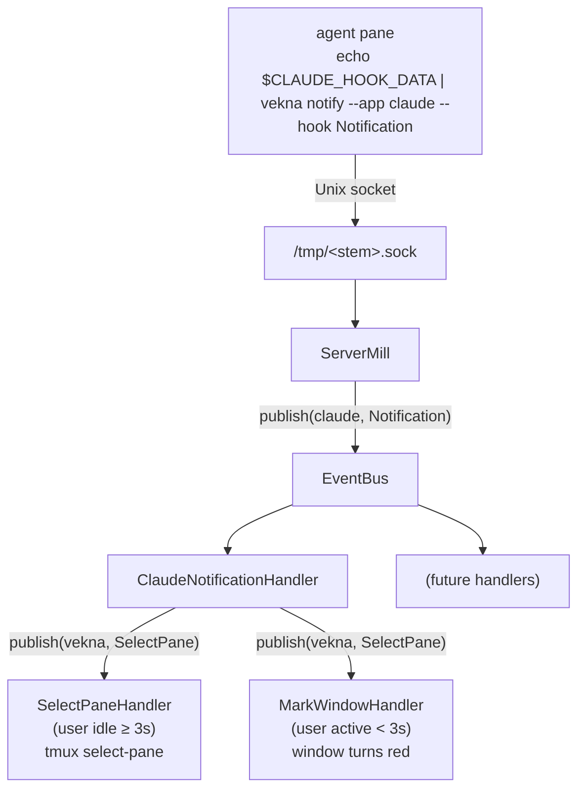

# vekna

Overseer for multiple Claude Code (or any coding agent) instances running in
tmux. One agent calls `vekna notify` → tmux jumps to its pane.

## Requires

- Python 3.10+
- `tmux` installed

## Install

```bash
pip install .
```

## Usage

Start a managed tmux session from the project you want to watch:

```bash
cd ~/projects/myapp
vekna
```

Each project directory gets its own vekna instance: the tmux socket,
tmux session, and Unix socket are all named after the current working
directory (`vekna-<basename>-<short-hash>`), so you can run one `vekna`
per project in parallel without them stepping on each other. Open
windows with `Ctrl-b c`, run a coding agent in each.

Configure each agent to call `vekna notify --app <app> --hook <hook>` as
its notification hook. The command reads `$TMUX` and `$TMUX_PANE` to find
the right server, and the server switches focus to whichever pane called.

### Claude Code configuration

Add a notification hook in Claude Code settings:

```
echo "$CLAUDE_HOOK_DATA" | vekna notify --app claude --hook Notification
```

`--app` and `--hook` are required. The command reads its payload from stdin
and picks up the target pane from `$TMUX_PANE` automatically.

### Commands

| Command | Effect |
|---------|--------|
| `vekna` | Start (or reattach to) the tmux session and notification server for the current directory |
| `vekna notify --app <app> --hook <hook>` | Send a notification from the current pane; payload read from stdin (requires `$TMUX` and `$TMUX_PANE`) |

### tmux basics

| Keys | Action |
|------|--------|
| `Ctrl-b c` | New window |
| `Ctrl-b n` / `Ctrl-b p` | Next / previous window |
| `Ctrl-b 0-9` | Switch to window by number |
| `Ctrl-b d` | Detach from session |

## How it works



- `vekna` derives a `<stem>` from `Path.cwd()` — `vekna-<basename>-<hash>`
  — ensures the tmux session exists, binds `/tmp/<stem>.sock`, and
  attaches the terminal.
- `vekna notify --app claude --hook Notification` reads stdin as the hook
  payload, captures `$TMUX_PANE`, and sends an `Event` to `/tmp/<stem>.sock`.
- The server deserialises the event with pydantic and publishes it to the
  `EventBus`.
- **ClaudeNotificationHandler** validates the payload and re-publishes an
  internal `(vekna, SelectPane)` event carrying the pane ID.
- Two handlers fire concurrently for every `SelectPane` event:
  - **SelectPaneHandler** — if the session has been idle for at least 3 s
    (`IDLE_THRESHOLD_SECONDS`), calls `select-pane` to jump to the notifying
    pane.
  - **MarkWindowHandler** — if the user is still active, highlights the
    notifying window red instead; a background loop clears the mark once the
    user navigates there.

Stem derivation and path fan-out live in `src/vekna/specs/constants.py`.

## Architecture

GLIMPSE layering (enforced by `import-linter`):

| Layer | Role |
|-------|------|
| `pacts` | Protocols, DTOs (pydantic) |
| `specs` | Constants |
| `mills` | Business logic (`ServerMill`, `NotifyClientMill`, `EventBus`, handlers) |
| `links` | I/O adapters (`TmuxLink`, `SocketServerLink`, `SocketClientLink`) |
| `gates` | Entry points (`ClickGate` — CLI) |
| `inits` | Wiring — registers handlers and starts background tasks |
| `edges` | Infra boundary |

Import rules in `pyproject.toml` under `[tool.importlinter]`.

## Development

```bash
mise run start      # dev server :8000
mise run test       # all tests
mise run check      # format + lint
```

Tooling: black, ruff (`select = ["ALL"]`), mypy strict, import-linter,
pytest, vulture, deptry, codespell, pip-audit.

## License

BSD-3-Clause. See `LICENSE`.
